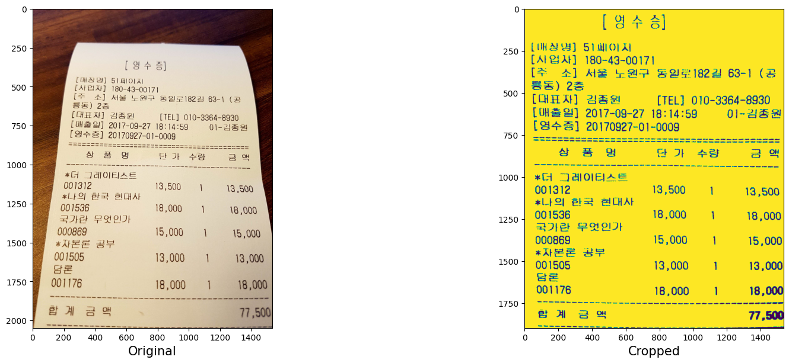
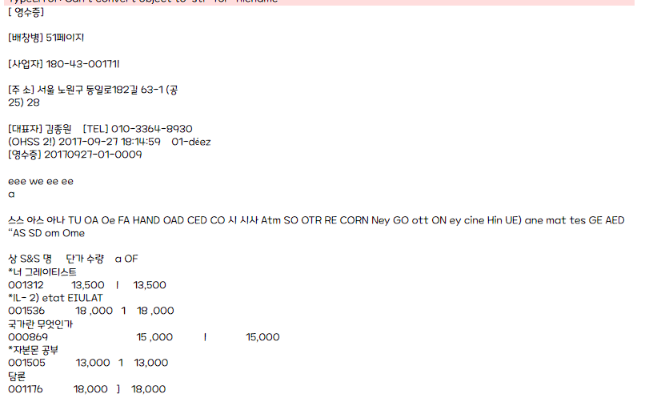
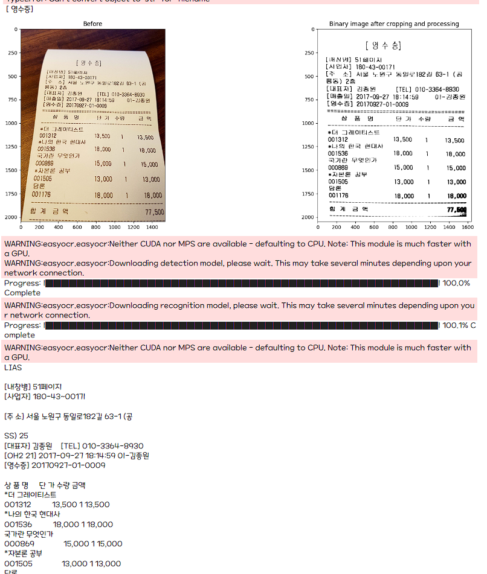

# bill-tesseractOCR
Tesseract, easyOCR 를 이용한 영수증을 OCR 

# 🔥 Skills

### AI

  &nbsp;&nbsp;
  &nbsp;&nbsp;
  &nbsp;&nbsp;
  

# 미리 보기
> 영수증을 크기와 각도를 조절하여 더 나은 결과를 얻어내기 위한 과정.

> 아직 읽지 못하는 글자들이 너무 많아 다른 방식으로 더 시도 해보기

> 세세한 파라미터 조정으로 더 좋은 결과를 얻어냈다.

